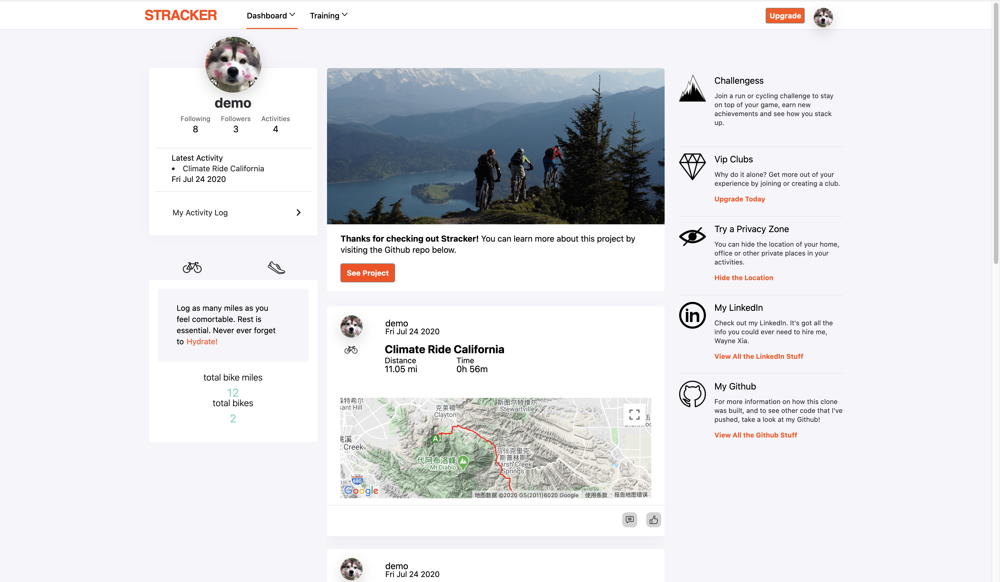
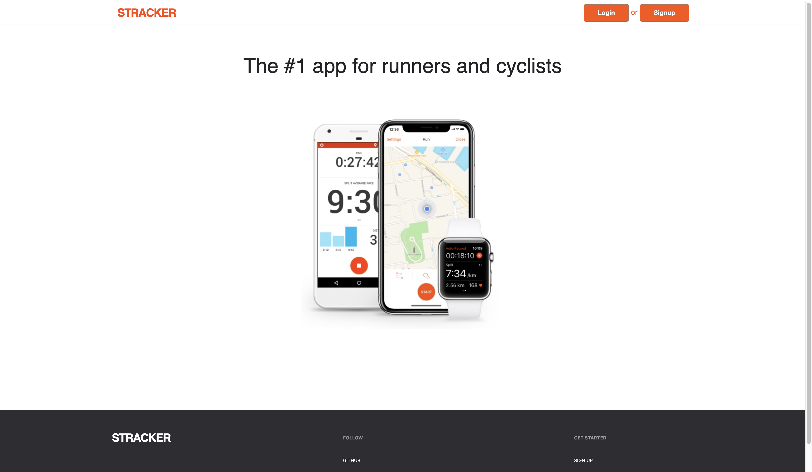
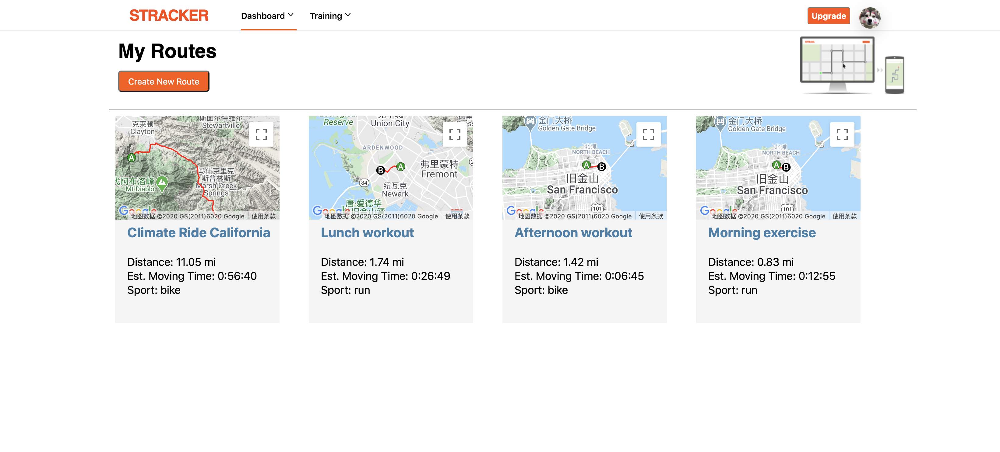
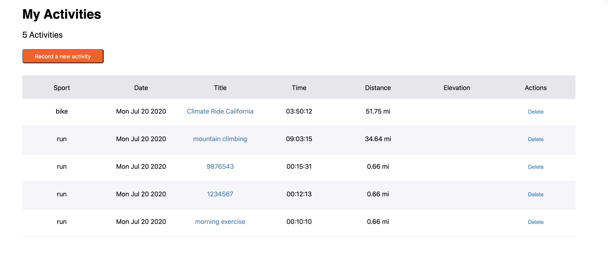

# Stracker

[Stracker](https://stracker-app-50523.herokuapp.com/#/) is a website for outdoor activities like running and biking. It has the capability of being able to track manually entered activities and display accumulated stats related to your activities; as well as generate a route between two points on a map and relay pertinent information, like distance and elevation.

[Live Demo](https://stracker-app-50523.herokuapp.com/#/)  
   

## Technologies Used

- Google Maps API (map placement and marker placement)
- Google Maps Directions Service API (route calculation)
- Google Maps Elevation API (elevation calculation)
- PostgreSQL for the database
- Ruby on Rails for the backend framework
- React for the Frontend with Redux to manage state
- jQuery AJAX for accessing the backend through Thunk actions
- SASS/CSS for styling

## Current Features

- User Authentication and Authorization using BCrypt
  - User login/Signup
  - Demo User
- Create/Save biking or running routes
- Create/Record Activities/Activity feed
- Display accumulated data for the user
- Create routes on a map and provide related data
- Track manually entered data related to outdoor activities
- Index of all personal workouts with sortable headers

### SignIn/SignUp Page
   

### Route Page
   

### Route Builder Toolbar
   

### Activities Page
   

## Schema Decsions
- Tables
  - Users
  - Activities
  - Routes (for the create route feature)
  - Followers
  - Kudos (likes)
  - Comments

## Future Changes
- Comment on activitiy feed items
- Like other people's activities
- Customer Vip Clubs
